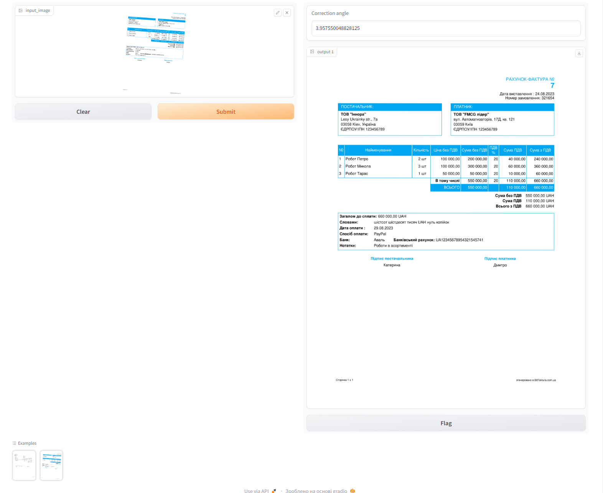

# Invoice angle correction

## Agenda
This repository is a solution to a test task. Quote: As part of the test task, you need to solve the following problem:
- Create a process to rotate documents to portrait orientation using an ML model that will determine the angle from -30 to 30 degrees.
- You are allowed to use pytorch and tf and any libraries that will be auxiliary.
- Time constraints: the model should run for about 5 seconds or less, but this is not a critical requirement.
- The process should be in a presentable state, i.e., documented and understandable during the review.
Also, we expect a requirements.txt file that lists all the libraries used in the process with their versions

Documents for the task are in the attachment.

To solve this task, you can use technologies, models, and libraries that are familiar to you at your discretion.
We give you 4 business days to complete the task. If you have any questions/clarifications, please do not hesitate to contact us.

Since I was allowed to use all the tools, I settled on the simplest algorithm, based on OpenCV, for correcting invoice orientation for several reasons:
1. Fast implementation
2. Simplicity.
3. Inference speed.
4. There is no need to sample a dataset.

However, the task could be fulfilled using a regression neural network trained for predicting document rotation angles.
In this case, we'd need to sample more data since 10 images aren't enough to create a representative dataset.
Since our input data can be a PDF file converted to an image, we could sample more invoices by pattern using Python.
Using a sampled dataset, we would have sufficient data for training NN.

## Instalation

```sh
git https://github.com/atgorvi/InvoiceOrientationCorrection.git
cd InvoiceOrientationCorrection

pip install -r requirements.txt
```

## Usage

### Pyhon script
To correct image and save it run:

```sh
python demo.py -i data/images/0.png -s data/images/0_corrected.png
```

### Gradio

To start the gradio demo UI run:

```sh
python gradio_demo.py
```
